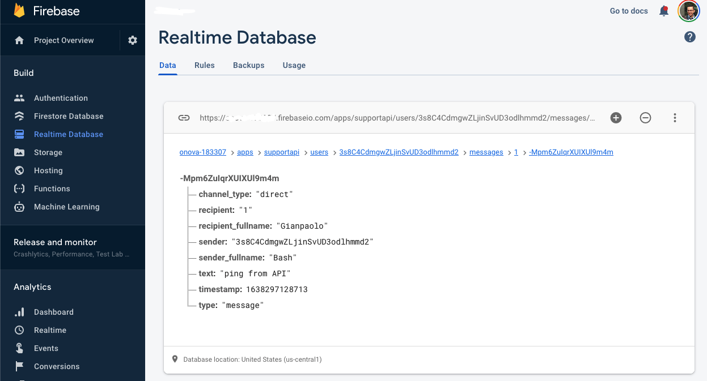

# REST API

> Below are described the REST APIs of Chat21

- [REST API](#rest-api)
  - [Authentication](#authentication)
    - [JWT Authentication](#jwt-authentication)
    - [Secret Authentication (for admin)](#secret-authentication-for-admin)
  - [Send a message](#send-a-message)
    - [Message attributes](#message-attributes)
  - [Create a Group](#create-a-group)
  - [Join a Group](#join-a-group)
  - [Leave a Group](#leave-a-group)
  - [Set Group members](#set-group-members)
  - [Delete a message from the personal timeline](#delete-a-message-from-the-personal-timeline)
  - [Delete a group message for me and other users](#delete-a-group-message-for-me-and-other-users)
  - [Archive or delete a conversation](#archive-or-delete-a-conversation)
  - [Create a Contact](#create-a-contact)
  - [Update my FirstName and Last Name](#update-my-firstname-and-last-name)
  - [Upload photo profile](#upload-photo-profile)
  - [Delete photo profile](#delete-photo-profile)
- [REST API for Support](#rest-api-for-support)
  - [Create support request](#create-support-request)
  - [Rate the request](#rate-the-request)
  - [Close Support group](#close-support-group)
  - [Subscribe/unsubscribe to receive emails](#subscribeunsubscribe-to-receive-emails)
  - [Webhook](#webhook)

## Authentication

We support two authentication methods: JWT and Shared Secret

### JWT Authentication

Generate a Firebase User JWT token with:

```bash
curl 'https://www.googleapis.com/identitytoolkit/v3/relyingparty/verifyPassword?key=<API_KEY>' \
     -H 'Content-Type: application/json' \
     -d '{"email":"<USER_EMAIL>", "password":"<USER_PASSWORD>", "returnSecureToken":true}'
```

The `API_KEY` is the Google Cloud Credentials API Key available under the `APIs and services`:
<https://console.cloud.google.com/apis/credentials?authuser=0&project=__firebase_project__>

A successful authentication is indicated by a `200` OK HTTP status code. The response contains the Firebase `idToken` and `refreshToken` associated with the existing email/password account.

More info here: <https://firebase.google.com/docs/reference/rest/auth/#section-sign-in-email-password>

### Secret Authentication (for admin)

To authenticate you can add the token query parameter to the endpoints. Example: `?token=[REDACTED_TOKEN],`
You can change the secret token for your installation with `firebase functions:config:set secret.token=MYSECRET`

## Send a message

You can send a message making a POST call to the endpoint:

```bash
  curl -X POST \
      -H 'Content-Type: application/json' \
      -H "Authorization: Bearer <FIREBASE_ID_TOKEN>" \
       -d '{"sender_fullname": "<SENDER_FULLNAME>", "recipient_id": "<RECIPIENT_ID>", "recipient_fullname":"<RECIPIENT_FULLNAME>","text":"<MESSAGE_TEXT>", "channel_type": "<CHANNEL_TYPE>", "type": "<TYPE>", "attributes": "<ATTRIBUTES>", "metadata": "<METADATA>"}' \
      'https://us-central1-<FIREBASE_PROJECT_ID>.cloudfunctions.net/api/<APP_ID>/messages'
```



Where:

| Variables             | Info                                                                                                                                                                                                                  |
| --------------------- | --------------------------------------------------------------------------------------------------------------------------------------------------------------------------------------------------------------------- |
| `FIREBASE_ID_TOKEN`   | JWT token generated using JWT Authentication Method                                                                                                                                                                   |
| `SENDER_FULLNAME`     | Sender Full name. Ex: Maria Leo                                                                                                                                                                                       |
| `RECIPIENT_ID`        | The recipient id of the message. The recipient id is the user id for direct message or the group id for group messaging.                                                                                              |
| `RECIPIENT_FULLNAME`  | The Recipient Full name. Ex: Andrea Sponziello                                                                                                                                                                        |
| `MESSAGE_TEXT`        | The message text                                                                                                                                                                                                      |
| `CHANNEL_TYPE`        | The channel type. `direct` value for one-to-one direct message and `group` for group messaging                                                                                                                        |
| `TYPE`                | The message type. `text` value for textual message and `image` for sending image message (you must set metadata field).                                                                                               |
| `ATTRIBUTES`          | The message custom attributes. Example: `{"custom_attribute1": "value1"}`.                                                                                                                                            |
| `METADATA`            | The image properties: `src` is the absolute path, `width` and `height` is the image. </br> Example: `{ "src": "https://www.tiledesk.com/wp-content/uploads/2018/03/tiledesk-logo.png", "width": 200, "height": 200 }` |
| `FIREBASE_PROJECT_ID` | The Firebase project id.                                                                                                                                                                                              |
| `APP_ID`              | The appid used on multitenant environment. Use `default` as default value                                                                                                                                             |

Example. Send a direct message to recipient id U4HL3GWjBsd8zLX4Vva0s7W2FN92 :

```bash
curl -X POST \
       -H 'Content-Type: application/json' \
       -H 'Authorization: Bearer xxxxx' \
       -d '{"sender_fullname": "Andrea Leo", "recipient_id": "U4HL3GWjBsd8zLX4Vva0s7W2FN92", "recipient_fullname":"Andrea Leo","text":"hello from API"}' \
       'https://us-central1-chat-v2-dev.cloudfunctions.net/api/tilechat/messages'
```

Example. Send a group message :

```bash
curl -X POST \
       -H 'Content-Type: application/json' \
       -H 'Authorization: Bearer xxxxx' \
       -d '{"sender_fullname": "Andrea Leo", "recipient_id": "-LKQQxIY4DDyG17FDiOM", "recipient_fullname":"Test group","text":"hello group from API","channel_type":"group"}' \
       'https://us-central1-chat-v2-dev.cloudfunctions.net/api/tilechat/messages'
```

Example. Send an image to recipient id `U4HL3GWjBsd8zLX4Vva0s7W2FN92`:

```bash
curl -X POST \
       -H 'Content-Type: application/json' \
       -H 'Authorization: Bearer xxxxx' \
       -d '{"sender_fullname": "Andrea Leo", "recipient_id": "U4HL3GWjBsd8zLX4Vva0s7W2FN92", "recipient_fullname":"Andrea Leo","text":"alt text", "type":"image", "metadata": { "src": "https://www.tiledesk.com/wp-content/uploads/2018/03/tiledesk-logo.png", "width": 200, "height": 200 } }' \
       'https://us-central1-chat-v2-dev.cloudfunctions.net/api/tilechat/messages'
```

Example. Send a message with PDF link to recipient id `U4HL3GWjBsd8zLX4Vva0s7W2FN92`:

```bash
curl -X POST \
       -H 'Content-Type: application/json' \
       -H 'Authorization: Bearer xxxxx' \
       -d '{"sender_fullname": "Andrea Leo", "recipient_id": "U4HL3GWjBsd8zLX4Vva0s7W2FN92", "recipient_fullname":"Andrea Leo","text":"https://www.unipg.it/files/pagine/410/4-PDF-A.pdf", "type":"text" }' \
       'https://us-central1-chat-v2-dev.cloudfunctions.net/api/tilechat/messages'
```

### Message attributes

With attributes you can add custom attribute to the message as described below but you can also control internal behaviors:

- disable push notification for specific message with attributes = `{"sendnotification":false}`
- disable conversation model update with attributes = `{"updateconversation":false}`
- send info message with blue badge to a chat. It's used to notifiy system events like: member join a chat, member leave a chat, etc.). You can send the info message using attributes = `{"subtype":"info"}`

## Create a Group

Create a chat user's group making the following POST call :

```bash
curl -X POST \
      -H 'Content-Type: application/json' \
      -H "Authorization: Bearer <FIREBASE_ID_TOKEN>" \
      -d '{"group_name": "<GROUP_NAME>", "group_members": {"<MEMBER_ID>":1}}' \
      'https://us-central1-<FIREBASE_PROJECT_ID>.cloudfunctions.net/api/<APP_ID>/groups'
```

Where :

- FIREBASE_ID_TOKEN : is a JWT token generated using JWT Authentication Method
- GROUP_NAME: it's the new group name
- MEMBER_ID: it's the user ids of the group members
- FIREBASE_PROJECT_ID: it's the Firebase project id. Find it on Firebase Console
- APP_ID: It's the appid usend on multitenant environment. Use "default" as default value

Example:

```bash
curl -v -X POST \
       -H 'Content-Type: application/json' \
       -H 'Authorization: Bearer xxxxxx' \
       -d '{"group_name": "TestGroup1", "group_members": {"y4QN01LIgGPGnoV6ql07hwPAQg23":1}}' 'https://us-central1-chat-v2-dev.cloudfunctions.net/api/tilechat/groups'
```

## Join a Group

With this API the user can join (become a member) of an existing group:

```bash
curl -X POST \
       -H 'Content-Type: application/json' \
       -H "Authorization: Bearer <FIREBASE_ID_TOKEN>" \
       -d '{"member_id": "<MEMBER_ID>"}' \
       https://us-central1-<FIREBASE_PROJECT_ID>.cloudfunctions.net/api/<APP_ID>/groups/<GROUP_ID>/members
```

Where :

- FIREBASE_ID_TOKEN : is a JWT token generated using JWT Authentication Method
- MEMBER_ID: it's the user id of the user you want to joing (become a member)
- FIREBASE_PROJECT_ID: it's the Firebase project id. Find it on Firebase Console
- APP_ID: It's the appid usend on multitenant environment. Use "default" as default value
- GROUP_ID: it's the existing group id

Example:

```bash
curl -X POST \
       -H 'Content-Type: application/json' \
       -H 'Authorization: Bearer xxxxxx' \
       -d '{"member_id": "81gLZhYmpTZM0GGuUI9ovD7RaCZ2"}' \
        https://us-central1-chat-v2-dev.cloudfunctions.net/api/tilechat/groups/-L5hnLkBGQoW05ax9ehg/members
```

## Leave a Group

With this API the user can leave of an existing group:

```bash
curl  -X DELETE \
       -H 'Content-Type: application/json' \
       -H "Authorization: Bearer <FIREBASE_ID_TOKEN>" \
       https://us-central1-<FIREBASE_PROJECT_ID>.cloudfunctions.net/api/<APP_ID>/groups/<GROUP_ID>/members/<MEMBERID>
```

Where :

- FIREBASE_ID_TOKEN : is a JWT token generated using JWT Authentication Method
- FIREBASE_PROJECT_ID: it's the Firebase project id. Find it on Firebase Console
- APP_ID: It's the appid usend on multitenant environment. Use "default" as default value
- GROUP_ID: it's the existing group id
- MEMBER_ID: it's the user id of the user you want to leave a group

Example:

```bash
curl -X DELETE \
      -H 'Content-Type: application/json' \
       -H 'Authorization: Bearer xxxxxx' \
        https://us-central1-chat-v2-dev.cloudfunctions.net/api/tilechat/groups/-L5hnLkBGQoW05ax9ehg/members/81gLZhYmpTZM0GGuUI9ovD7RaCZ2
```

## Set Group members

With this API you can set the group members

```bash
curl -X PUT \
       -H 'Content-Type: application/json' \
       -H "Authorization: Bearer <FIREBASE_ID_TOKEN>" \
       -d '{"members": {"<member_id1>":1},{"<member_id2>":1}}' \
       https://us-central1-<FIREBASE_PROJECT_ID>.cloudfunctions.net/api/<APP_ID>/groups/<GROUP_ID>/members
```

Where :

- FIREBASE_ID_TOKEN : is a JWT token generated using JWT Authentication Method
- FIREBASE_PROJECT_ID: it's the Firebase project id. Find it on Firebase Console
- MEMBER_IDs: it's the user ids of the group members
- APP_ID: It's the appid usend on multitenant environment. Use "default" as default value
- GROUP_ID: it's the existing group id

Example:

```bash
curl -X PUT \
       -H 'Content-Type: application/json' \
       -H 'Authorization: Bearer xxxxx' \
       -d '{"members": {"system":1}}' \
        https://us-central1-chat-v2-dev.cloudfunctions.net/api/tilechat/groups/support-group-L5xro2P81zHs7YA7-DX/members
```

## Delete a message from the personal timeline

Delete a message from the personal timeline of a conversation specified by a RECIPIENT_ID

```bash
curl  -X DELETE \
       -H 'Content-Type: application/json' \
       -H "Authorization: Bearer <FIREBASE_ID_TOKEN>" \
       https://us-central1-<FIREBASE_PROJECT_ID>.cloudfunctions.net/api/<APP_ID>/messages/<RECIPIENT_ID>/<MESSAGE_ID>
```

Where :

- FIREBASE_ID_TOKEN : is a JWT token generated using JWT Authentication Method
- FIREBASE_PROJECT_ID: it's the Firebase project id. Find it on Firebase Console
- APP_ID: It's the appid usend on multitenant environment. Use "default" as default value
- RECIPIENT_ID: it's the recipient id
- MESSAGE_ID: it's the message id

Example:

```bash
curl -X DELETE \
      -H 'Content-Type: application/json' \
       -H 'Authorization: Bearer [REDACTED_JWT]' \
        https://us-central1-chat-v2-dev.cloudfunctions.net/api/tilechat/messages/y4QN01LIgGPGnoV6ql07hwPAQg23/-L7iJ5QljBP7sPkN73Km
```

## Delete a group message for me and other users

Delete a message from all the timelines of a conversation specified by a RECIPIENT_ID

```bash
curl  -X DELETE \
       -H 'Content-Type: application/json' \
       -H "Authorization: Bearer <FIREBASE_ID_TOKEN>" \
       'https://us-central1-<project-id>.cloudfunctions.net/api/<APP_ID>/messages/<RECIPIENT_ID>/<MESSAGE_ID>?all=true&channel_type=group'
```

Where :

- FIREBASE_ID_TOKEN : is a JWT token generated using JWT Authentication Method
- FIREBASE_PROJECT_ID: it's the Firebase project id. Find it on Firebase Console
- APP_ID: It's the appid usend on multitenant environment. Use "default" as default value
- RECIPIENT_ID: it's the recipient id
- MESSAGE_ID: it's the message id

Example:

```bash
curl -v -X DELETE \
      -H 'Content-Type: application/json' \
       -H 'Authorization: Bearer [REDACTED_JWT]' \
        'https://us-central1-chat-v2-dev.cloudfunctions.net/api/tilechat/messages/-L7iM75Pweqz2Atl7w1z/-L7iMFJKt06ixZFG_p4e?all=true&channel_type=group'


```

## Archive or delete a conversation

Archive or delete a conversation from the personal timeline specified by a RECIPIENT_ID

```bash
curl  -X DELETE \
       -H 'Content-Type: application/json' \
       -H "Authorization: Bearer <FIREBASE_ID_TOKEN>" \
       https://us-central1-<FIREBASE_PROJECT_ID>.cloudfunctions.net/api/<APP_ID>/conversations/<RECIPIENT_ID>?delete=<BOOLEAN_VALUE>
```

Where :

- FIREBASE_ID_TOKEN : is a JWT token generated using JWT Authentication Method
- FIREBASE_PROJECT_ID: it's the Firebase project id. Find it on Firebase Console
- APP_ID: It's the appid usend on multitenant environment. Use "default" as default value
- RECIPIENT_ID: it's the recipient id
- delete: (Optional) if true permanently deletes the conversation, if false archives the conversation

Example:

```bash
curl -v -X DELETE \
      -H 'Content-Type: application/json' \
       -H 'Authorization: Bearer [REDACTED_JWT]' \
        https://us-central1-chat-v2-dev.cloudfunctions.net/api/tilechat/conversations/y4QN01LIgGPGnoV6ql07hwPAQg23/
```

## Create a Contact

Create a new contact.

```bash
curl -X POST \
      -H 'Content-Type: application/json' \
      -H "Authorization: Bearer <FIREBASE_ID_TOKEN>" \
      -d '{"firstname": "<FIRSTNAME>", "lastname": "<LASTNAME>","email": "<EMAIL>"}' \
      https://us-central1-<FIREBASE_PROJECT_ID>.cloudfunctions.net/api/<APP_ID>/contacts
```

Where :

- FIREBASE_ID_TOKEN : is a JWT token generated using JWT Authentication Method
- FIRSTNAME: it's the firstname of the contact
- LASTNAME: it's the lastname of the contact
- EMAIL: it's the contact email
- FIREBASE_PROJECT_ID: it's the Firebase project id. Find it on Firebase Console
- APP_ID: It's the appid usend on multitenant environment. Use "default" as default value

Example:

```bash
curl -v -X POST \
       -H 'Content-Type: application/json' \
       -H 'Authorization: Bearer [REDACTED_JWT]' \
        -d '{"firstname": "firstname", "lastname": "lastname","email": "email"}' \
    https://us-central1-chat-v2-dev.cloudfunctions.net/api/tilechat/contacts
```

## Update my FirstName and Last Name

Change my first and lastname:

```bash
curl -X PUT \
      -H 'Content-Type: application/json' \
      -H "Authorization: Bearer <FIREBASE_ID_TOKEN>" \
      -d '{"firstname": "<FIRSTNAME>", "lastname": "<LASTNAME>"}' \
      https://us-central1-<FIREBASE_PROJECT_ID>.cloudfunctions.net/api/<APP_ID>/contacts/me
```

Where :

- FIREBASE_ID_TOKEN : is a JWT token generated using JWT Authentication Method
- FIRSTNAME: it's the firstname of the contact
- LASTNAME: it's the lastname of the contact
- FIREBASE_PROJECT_ID: it's the Firebase project id. Find it on Firebase Console
- APP_ID: It's the appid usend on multitenant environment. Use "default" as default value

Example:

```bash
curl -v -X PUT \
       -H 'Content-Type: application/json' \
       -H 'Authorization: Bearer [REDACTED_JWT]' \
        -d '{"firstname": "firstname", "lastname": "lastname"}' \
    https://us-central1-chat-v2-dev.cloudfunctions.net/api/tilechat/contacts/me
```

## Upload photo profile

Upload my photo profile

```bash
curl -X PUT \
      -H 'Content-Type: application/json' \
      -H "Authorization: Bearer <FIREBASE_ID_TOKEN>" \
      https://us-central1-<FIREBASE_PROJECT_ID>.cloudfunctions.net/api/<APP_ID>/contacts/me/photo
```

Where :

- `FIREBASE_ID_TOKEN`: JWT token generated using JWT Authentication Method
- `FIREBASE_PROJECT_ID`: the Firebase project id. Find it on Firebase Console
- `APP_ID`: the appid usend on multitenant environment. Use "default" as default value

Example:

```bash
curl -v -X PUT \
       -H 'Authorization: Bearer xxxxx' \
       -F "image=@/Users/andrealeo/Downloads/a.jpg" \
    https://us-central1-chat-v2-dev.cloudfunctions.net/api/tilechat/contacts/me/photo
```

## Delete photo profile

Delete my photo profile

```bash
curl -X DELETE \
      -H 'Content-Type: application/json' \
      -H "Authorization: Bearer <FIREBASE_ID_TOKEN>" \
      https://us-central1-<FIREBASE_PROJECT_ID>.cloudfunctions.net/api/<APP_ID>/contacts/me/photo
```

Where :

- FIREBASE_ID_TOKEN : is a JWT token generated using JWT Authentication Method
- FIREBASE_PROJECT_ID: it's the Firebase project id. Find it on Firebase Console
- APP_ID: It's the appid usend on multitenant environment. Use "default" as default value

Example:

```bash
curl -v -X DELETE \
       -H 'Content-Type: application/json' \
       -H 'Authorization: Bearer xxxxx' \
    https://us-central1-chat-v2-dev.cloudfunctions.net/api/tilechat/contacts/me/photo
```

# REST API for Support

## Create support request

```bash
curl -X POST \
      -H 'Content-Type: application/json' \
      -H "Authorization: Bearer <FIREBASE_ID_TOKEN>" \
       -d '{"sender_fullname": "<FULLNAME>","text":"helo from API","projectid":"<Project_id>"}' \
      https://us-central1-<project-id>.cloudfunctions.net/supportapi/<APP_ID>/requests
```

Example:

```bash
curl -X POST \
       -H 'Content-Type: application/json' \
       -d '{"sender_fullname": "Andrea Leo", "text":"hello from API","projectid":"5ab0f32757066e0014bfd718"}' \
       'https://us-central1-chat-v2-dev.cloudfunctions.net/supportapi/tilechat/requests?token=[REDACTED_TOKEN],'
```

## Rate the request

```bash
curl -X PUT \
      -H 'Content-Type: application/json' \
      -H "Authorization: Bearer <FIREBASE_ID_TOKEN>" \
      https://us-central1-<project-id>.cloudfunctions.net/supportapi/<APP_ID>/requests/<REQUEST_ID>/rate?rating=2&rating_message=ciao
```

Example:

```bash
curl -X PUT \
       -H 'Content-Type: application/json' \
       'https://us-central1-chat-v2-dev.cloudfunctions.net/supportapi/tilechat/requests/support-group-LM879tEdviVwDkNmo94/rate?token=[REDACTED_TOKEN],&rating=2&rating_message=ciao'
```

## Close Support group

Where :

- <FIREBASE_ID_TOKEN> : is a JWT token generated using JWT Authentication Method
- <GROUP_ID>: is the group id to close
- open: (Optional)If true reopen an existing closed group
- <FIREBASE_PROJECT_ID>: it's the Firebase project id. Find it on Firebase Console
- <APP_ID>: It's the appid usend on multitenant environment. Use "default" as default value

```bash
curl -X PUT \
       -H 'Content-Type: application/json' \
       -H "Authorization: Bearer <FIREBASE_ID_TOKEN>" \
       https://us-central1-<project-id>.cloudfunctions.net/supportapi/<APP_ID>/groups/<GROUP_ID>?open=true/false
```

Example:

```bash
curl -X PUT \
       -H 'Content-Type: application/json' \
       -H 'Authorization: Bearer xxxxx' \
        https://us-central1-chat-v2-dev.cloudfunctions.net/supportapi/tilechat/groups/support-group-LBqsOVQS59IZPWWY_me
```

## Subscribe/unsubscribe to receive emails

```bash
curl -X POST \
      -H 'Content-Type: application/json' \
      -d '{"user_id": "<USER_ID>", "is_subscribed": "<IS_SUBSCRIBED>"}' \
      https://us-central1-<project-id>.cloudfunctions.net/api/<APP_ID>/users/<USER_ID>/settings/email?token=[REDACTED_TOKEN],
```

Example:

```bash
curl -X POST \
      -H 'Content-Type: application/json' \
      -d '{"user_id": "u2K7nLo2dTZEOYYTykrufN6BDF92", "is_subscribed": "true"}' \
      https://us-central1-chat-v2-dev.cloudfunctions.net/api/tilechat/users/u2K7nLo2dTZEOYYTykrufN6BDF92/settings/email?token=[REDACTED_TOKEN],
```

## Webhook

- Enable webhook with `firebase functions:config:set webhook.enabled=true`
- Set on new message webhook url with : `firebase functions:config:set webhook.onmessage.url=http://localhost:3000/requests`

TODO

```bash
curl -v -X GET \
      -H 'Content-Type: application/json' \
      'https://us-central1-chat-v2-dev.cloudfunctions.net/webhookapi/?hub.mode=subscribe&hub.verify_token=webhooksecret'
```
